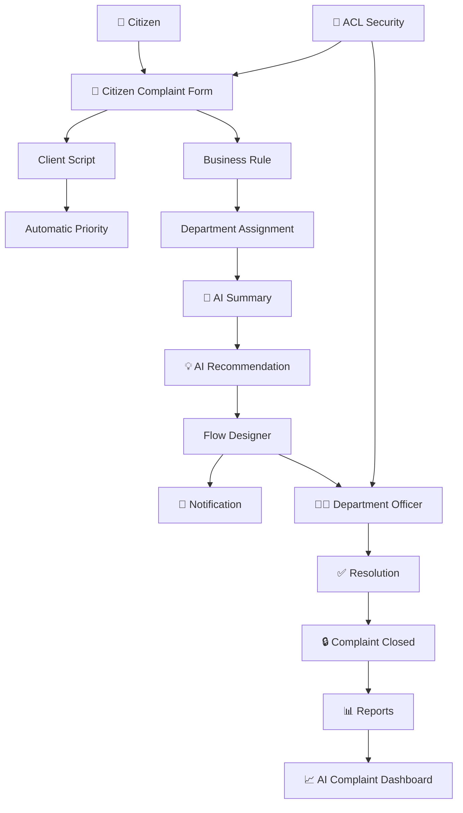

# 🤖 AI-Powered Citizen Complaint Management System

> **A ServiceNow-based intelligent complaint management platform that automates the complete citizen complaint lifecycle — from registration and intelligent routing to resolution and reporting.**

<p align="center">

**ServiceNow • AI Concepts • Flow Designer • Business Rules • Client Scripts • ACLs • Dashboards**

</p>

---

## 🌍 Problem

Municipal organizations receive complaints about:

* 🚰 Water leakage
* 🗑️ Garbage accumulation
* 💡 Street-light failures
* 🛣️ Road damage
* 🌳 Public park maintenance
* 🚧 Drainage blockages

Traditional complaint handling often depends on phone calls, paperwork, and manual department assignment.

This can result in:

❌ Delayed complaint resolution
❌ Manual department assignment
❌ Lack of centralized tracking
❌ Repeated administrative work
❌ Limited visibility into complaint trends
❌ Delayed notifications

### 💡 Our Solution

This project provides a centralized **ServiceNow Citizen Complaint Management System** that automates the complaint lifecycle and uses AI-inspired capabilities to assist municipal employees in processing complaints efficiently.

---

# 🚀 What Makes This Project Different?

Instead of simply creating a complaint form, the system automates what happens **after a citizen submits the complaint**.

```text
👤 Citizen
     │
     ▼
📝 Submit Complaint
     │
     ▼
⚡ Automatic Priority
     │
     ▼
🧠 Intelligent Department Routing
     │
     ▼
🤖 AI Summary
     │
     ▼
💡 AI Recommendation
     │
     ▼
📧 Automatic Notification
     │
     ▼
👨‍💼 Department Resolution
     │
     ▼
✅ Complaint Closed
     │
     ▼
📊 Reports & Dashboard
```

---

# ✨ Key Features

| Feature                   | What it does                                                      |
| ------------------------- | ----------------------------------------------------------------- |
| 📝 Complaint Registration | Citizens can register complaints and provide details              |
| ⚡ Auto Priority           | Priority is automatically assigned based on complaint category    |
| 🏢 Department Routing     | Complaints are automatically routed to the appropriate department |
| 🤖 AI Summary             | Generates a concise summary of the complaint                      |
| 💡 AI Recommendation      | Suggests an appropriate resolution action                         |
| 🔄 Flow Automation        | Automates complaint processing and notifications                  |
| 📧 Notifications          | Notifies responsible departments when complaints are created      |
| 🔐 ACL Security           | Provides role-based access to complaint records                   |
| 📊 Reports                | Analyzes complaints by category, status, priority and department  |
| 📈 Dashboard              | Provides centralized complaint monitoring                         |
| 📚 Knowledge Management   | Provides resolution procedures for common complaints              |

---

# 🧠 AI Capabilities

The project demonstrates AI-inspired ServiceNow capabilities including:

### 🤖 AI Complaint Summary

Instead of reading the complete complaint description, officers can quickly understand the issue through a generated summary.

**Example:**

> Citizen reported a water leakage issue near the public park. Complaint categorized as Water Leakage and routed to the Water Department for immediate inspection.

### 💡 AI Recommendation

The system provides recommended actions based on the complaint.

**Example:**

```text
Water Leakage
      ↓
Assign to Water Department
      ↓
Inspect damaged pipeline
```

### 🏢 Intelligent Routing

Complaint categories are automatically mapped to departments.

| Complaint        | Department            |
| ---------------- | --------------------- |
| 🚰 Water Leakage | Water Department      |
| 🗑️ Garbage      | Sanitation Department |
| 💡 Street Light  | Electrical Department |
| 🛣️ Road Damage  | Roads Department      |
| 🌳 Parks         | Parks Department      |

---

# 🏗️ ServiceNow Architecture



---

# 🛠️ Technology Stack

### Platform

* **ServiceNow**
* Scoped Application
* ServiceNow Studio

### Automation

* Flow Designer
* Business Rules
* Client Scripts
* UI Policies

### AI Concepts

* AI Summary
* AI Recommendation
* AI-based Department Routing
* Now Assist concept
* AI Search concept

### Security

* Roles
* ACLs
* Role-based access control

### Analytics

* Reports
* Dashboard
* Complaint statistics

### Knowledge

* ServiceNow Knowledge Management

---

# 👥 User Roles

| Role                     | Responsibility                                         |
| ------------------------ | ------------------------------------------------------ |
| 👤 Citizen               | Register complaints and track status                   |
| 👨‍💼 Department Officer | View and resolve assigned complaints                   |
| 📊 Manager               | Monitor dashboards and reports                         |
| ⚙️ Administrator         | Configure application and security                     |
| 🤖 AI Assistant          | Assist with summarization, routing and recommendations |

---

# 🔄 Complaint Lifecycle

```text
CREATED
   ↓
PRIORITY ASSIGNED
   ↓
DEPARTMENT ASSIGNED
   ↓
AI SUMMARY GENERATED
   ↓
AI RECOMMENDATION GENERATED
   ↓
NOTIFICATION SENT
   ↓
DEPARTMENT RESOLUTION
   ↓
RESOLVED
   ↓
CLOSED
```

---

# ⚙️ ServiceNow Implementation

## 1️⃣ Scoped Application

The project is developed as a dedicated ServiceNow Scoped Application using ServiceNow Studio.

### Main components

```text
Citizen Complaint Management
│
├── Citizen Complaint Table
├── Department Table
├── Roles
├── ACLs
├── Client Scripts
├── Business Rules
├── UI Policies
├── Flow Designer
├── Notifications
├── Reports
├── Dashboard
└── Knowledge Articles
```

---

## 2️⃣ Custom Tables

### Citizen Complaint

Important fields include:

* Citizen Name
* Phone
* Email
* Location
* Complaint Category
* Description
* Priority
* Status
* AI Summary
* Predicted Category
* Assigned Department
* AI Recommendation
* Resolution
* Created Date
* Resolved Date

### Department

Stores:

* Department Name
* Manager
* Email
* Location

---

# ⚡ Automation Examples

### Client Script

Automatically determines priority.

```text
Water Leakage  → HIGH
Garbage        → MEDIUM
Street Light   → MEDIUM
Road Damage    → HIGH
Parks          → LOW
```

### Business Rule

Automatically routes complaints.

```text
Water Leakage → Water Department
Garbage       → Sanitation Department
Street Light  → Electrical Department
Road Damage   → Roads Department
Parks         → Parks Department
```

### UI Policy

The Resolution field is displayed when:

```text
Status = Resolved
```

### Flow Designer

```text
Complaint Created
       ↓
Generate Notification
       ↓
Update Complaint
       ↓
Notify Department
       ↓
End
```

---

# 🔐 Security

The application uses ServiceNow **Roles and ACLs** to control access.

```text
Citizen
  ↓
Submit / View own complaints

Department Officer
  ↓
Update assigned complaints

Manager
  ↓
Monitor reports & dashboards

Administrator
  ↓
Full application configuration
```

This prevents unauthorized users from accessing complaint information outside their responsibilities.

---

# 📊 Reports & Dashboard

The project provides reports for:

* 📌 Complaints by Category
* 📌 Complaints by Status
* 📌 Complaints by Priority
* 📌 Complaints by Department
* 🤖 AI-Routed Complaints

### Dashboard

The Citizen Complaint AI Dashboard provides visibility into:

```text
Total Complaints
       +
Category Distribution
       +
Department Distribution
       +
Priority Distribution
       +
Complaint Status
```

This helps managers identify complaint trends and monitor operational performance.

---

# 📚 Knowledge Management

Knowledge Articles were created for common complaint resolution procedures:

* 🚰 Water Leakage Resolution
* 🗑️ Garbage Collection
* 💡 Street Light Maintenance
* 🛣️ Road Repair
* 🚧 Drainage Blockage

These articles help department staff access standardized resolution procedures.

---

# 🧪 Testing

The application was validated using multiple scenarios.

| Test | Scenario         | Expected Result                |
| ---- | ---------------- | ------------------------------ |
| 1    | Create complaint | Complaint created successfully |
| 2    | Water Leakage    | Priority = High                |
| 3    | Garbage          | Department = Sanitation        |
| 4    | Flow execution   | Notification triggered         |
| 5    | Dashboard        | Complaint statistics updated   |
| 6    | ACL              | Unauthorized access restricted |

The project documentation also includes validation of complaint registration, automatic priority, department assignment, Flow Designer automation, AI summary, Predictive Intelligence, and ACL security.

check above files documentation...

# 📸 Project Screenshot
### 🏠 ServiceNow Application
### 📝 Citizen Complaint Form
### 🤖 AI Summary & Recommendation

### 🔄 Flow Designer

### 📊 Dashboard

`Add screenshot here

### 🔐 ACL / Security
# 🎯 Business Impact

The solution aims to:

✅ Reduce manual complaint processing
✅ Reduce department-assignment delays
✅ Improve complaint visibility
✅ Automate notifications
✅ Support faster resolution
✅ Improve citizen transparency
✅ Provide centralized reporting
✅ Reduce administrative efforts

### Implemented

*  Scoped Application
*  Citizen Complaint Table
*  Department Table
*  Roles
*  ACL Security
*  Client Script
*  Business Rules
*  UI Policy
*  Flow Designer
*  Notifications
*  AI Summary
*  AI Recommendation
*  Department Routing
*  Reports
*  Dashboard
*  Knowledge Management
*  Testing & Validation

---

# 🚀 Future Enhancements

The platform can be extended with licensed enterprise capabilities such as:

* 🔎 AI Search
* 💬 Virtual Agent
* 📊 Performance Analytics
* 🧠 Advanced Predictive Intelligence
* 📱 Citizen mobile experience
* 🗺️ Location-based complaint visualization

The current project demonstrates AI concepts using available ServiceNow platform capabilities; some advanced enterprise AI capabilities require additional licensing.

---

# 👩‍💻 Author

**Bhavani Suravaram**

🎓 Computer Science Engineering
🛠️ ServiceNow Developer | JavaScript | ITSM |ITOM| AI Automation

---

## ⭐ Why this project?

> **From complaint registration to intelligent routing, automated communication, resolution, and analytics — the goal is to make citizen service management smarter, faster, and more transparent.**

⭐ If you find this project interesting, consider starring the repository!
